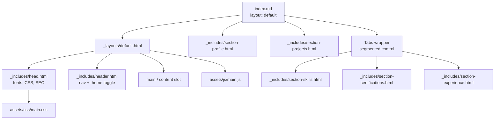
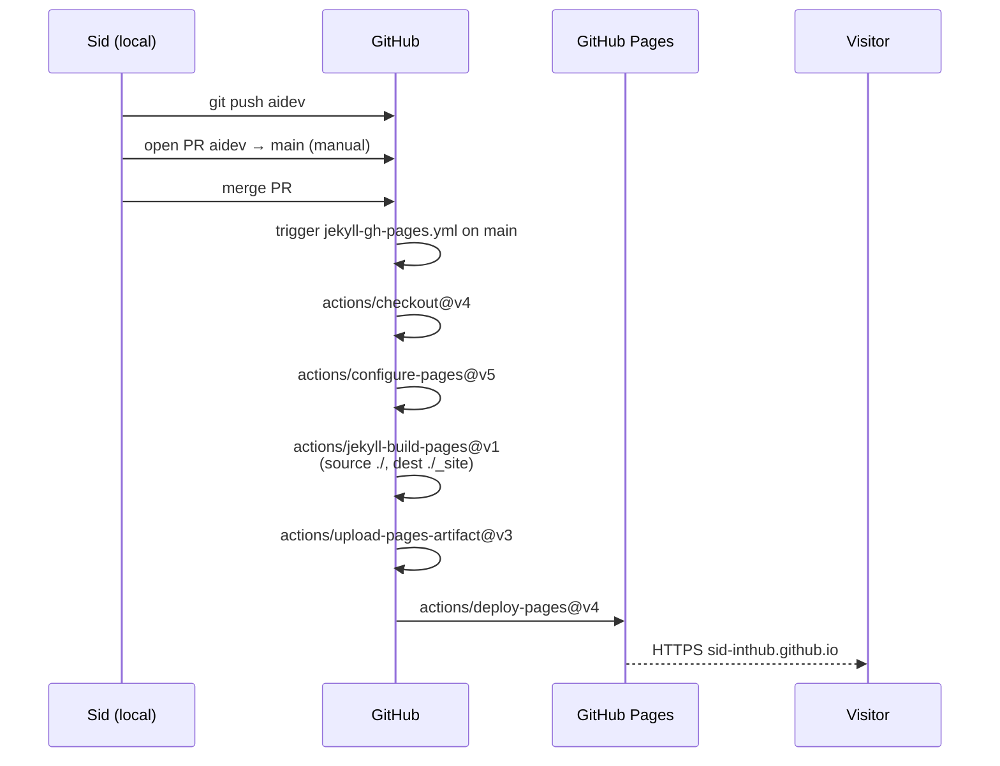
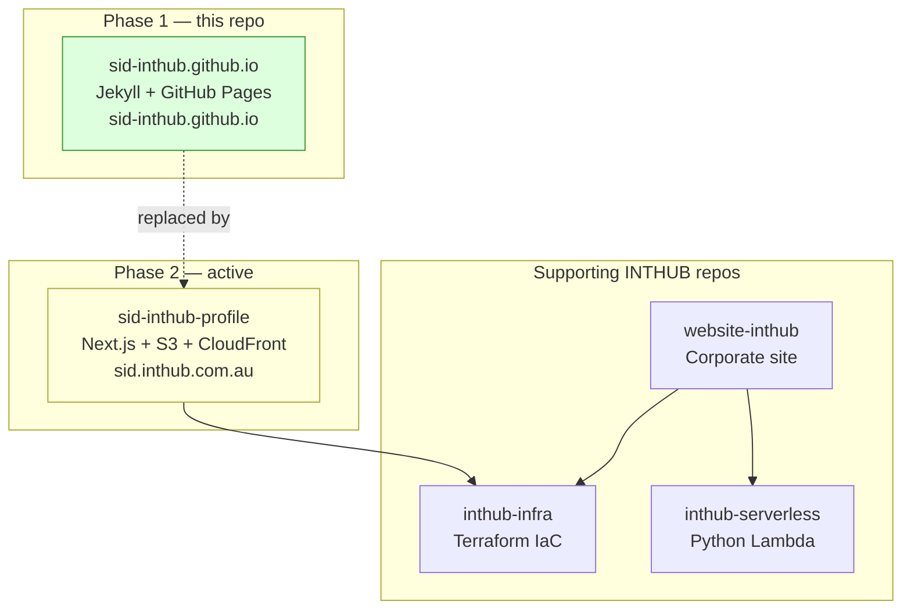

# ARCHITECTURE — sid-inthub.github.io (Phase 1)

System design for the **Phase 1** personal portfolio. This is a static Jekyll site on GitHub Pages — intentionally simple, no backend, no bundler, no AWS.

Phase 2 (`sid-inthub-profile`, Next.js → `sid.inthub.com.au`) is a separate codebase and is **not** described here. This repo is in maintenance mode.

---

## System overview

```mermaid
flowchart LR
  Author[Sid / Author] -->|edit| Repo[sid-inthub.github.io repo]
  Repo -->|push to aidev| AIDev[aidev branch]
  AIDev -->|manual PR + merge| Main[main branch]
  Main -->|push trigger| GHA[GitHub Actions:<br/>jekyll-gh-pages.yml]
  GHA --> Build[actions/jekyll-build-pages]
  Build --> Artifact[Pages artifact: _site/]
  Artifact --> Deploy[actions/deploy-pages]
  Deploy --> Pages[GitHub Pages CDN]
  Pages -->|HTTPS| Visitor[Visitor browser]
```

- **No AWS, no S3, no CloudFront.** Hosting is GitHub Pages end-to-end.
- **No build step in the repo** — `actions/jekyll-build-pages@v1` builds in CI; locally `bundle exec jekyll build` does the same.
- **No tests, no lint.** GitHub Pages build success is the only gate.

---

## Site composition

### Single-page shell

[`index.md`](index.md) is a thin Jekyll page with `layout: default`. It pulls in the section partials in this order:

1. `section-profile` — name, headline, contact links, availability
2. `section-projects` — three featured project cards (CliqMenu, SRG Integration, Sunsuper ICC)
3. A `.tabs-wrapper` div containing a segmented-control (Skills | Certifications & Edu | Experience) and three tab panels

The tab structure exists in the HTML; behavior is layered on by `main.js`.

### Layout chrome

[`_layouts/default.html`](_layouts/default.html) wraps content with `head` + `header` + a `.container > main > .main-container` shell + the JS bundle. There is no footer partial — by design.

### Styling

- [`assets/css/main.css`](assets/css/main.css) (~954 lines) — primary stylesheet. Defines the design tokens, dark/light theme via `[data-theme='dark']` on `<body>`, layout, components.
- [`assets/css/styles.css`](assets/css/styles.css) (~420 lines) — secondary stylesheet, loaded for legacy/auxiliary styles.
- The `pages-themes/minimal` remote theme is the structural fallback, but local CSS overrides almost every visible aspect.

### Interactive behavior

All in [`assets/js/main.js`](assets/js/main.js), no framework. Three concerns:

1. **Mobile nav toggle** — hamburger button opens/closes `.nav-links`; click on a link closes it.
2. **Theme toggle** — reads `localStorage.theme`, falls back to `prefers-color-scheme`, persists on click, updates the icon, listens for OS theme changes.
3. **Segmented tabs** — toggles `.active` on buttons + panels; reads `#hash` on load and on `hashchange` to deep-link into a specific tab (e.g. `/#experience` opens the Experience tab and scrolls to it).

---

## Deploy pipeline (detail)

**Notes:**

- The workflow uses GitHub's hosted runners and the GitHub-Pages-resolved gem versions — **not** the local `Gemfile.lock`. That's why version drift between local and prod is mostly harmless.
- Deploy time is ~1–2 min after merge to `main`.
- There is a second workflow [`.github/workflows/blank.yml`](.github/workflows/blank.yml) — a no-op "Hello world" CI stub. It runs on push/PR to `main` but produces nothing useful. Safe to leave or delete.

---

## Cross-repo position

- Phase 1 (this repo) is **frozen** in maintenance.
- Phase 2 is the place for new profile work.
- The INTHUB supporting repos (`inthub-infra`, `inthub-serverless`, `website-inthub`) do not interact with this site — GitHub Pages handles everything here.

---

## Decisions worth knowing

- **Stay on `pages-themes/minimal`.** The local CSS assumes its DOM. Replacing the theme would force a full visual rewrite for no gain.
- **No build step beyond Jekyll.** Adding Tailwind, esbuild, or a JS bundler is explicitly out of scope. Phase 2 is the place for modern tooling.
- **Manual PR-based deploy.** No `auto-promote-pr.yml` like other INTHUB repos — the manual gate is deliberate so a stray `aidev` commit can't accidentally go live.
- **Open: deprecate vs 301-redirect to Phase 2.** Undecided. Both are reversible enough that no action is taken until Sid chooses.
